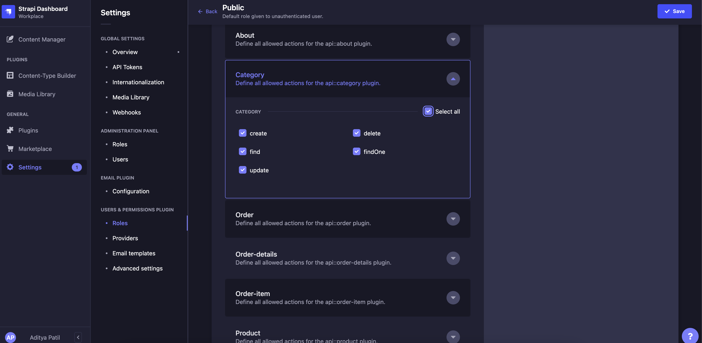
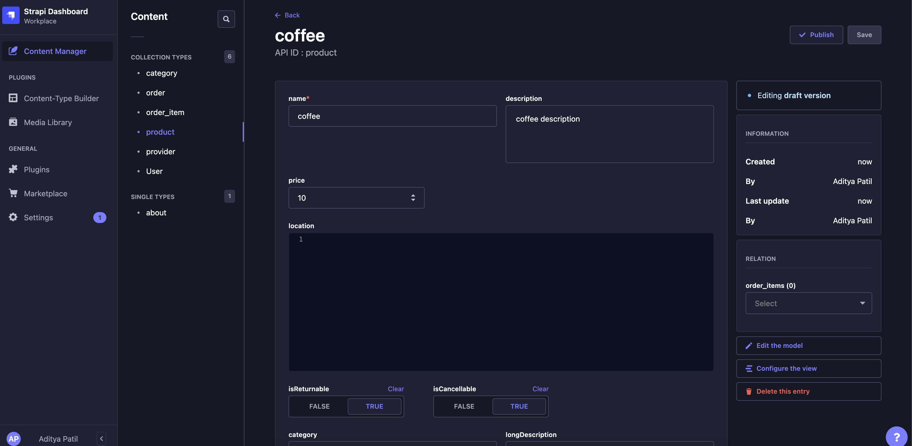
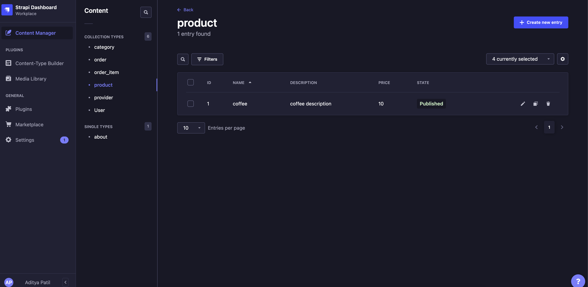

# Introduction
This repo is ONDC Seller App with microservice architecture which contains

- protocol layer(python) with implemented Rabbitmq queue
- client API layer (node js) with Strapi (Headless CMS)

# for whom
1. wants to refer the seller app 
2. wants the same setup to be available in their infra 
3. pick any component of it and use separately

# HOW to run locally

1) Make sure you've pulled all
   sub-directories, [CMD](https://stackoverflow.com/questions/1030169/pull-latest-changes-for-all-git-submodules)
2) Create **.env** file using **.env.example** file and update the required fields associated to Seller App in ONDC Network
3) Run 
```bash
   docker-compose -f docker-compose-for-local.yaml up -d
```
4) Visit http://localhost/admin and signup on strapi account (account is getting created on self hosted strapi, not on cloud) 
5) Provide permissions on http://localhost/admin/settings/users-permissions/roles/2 for `Category, Order, Order-details, Order-item, Product, Provider`
   
6) Create product entry on http://localhost/admin/content-manager/collectionType/api::product.product 

7) Confirm entry, Note: status should be `Published` not `Draft`

8) Get [webhook.site](https://webhook.site/) url to verify if search flow is working
9) Test by making /search request (Update webhook-url in context)
```curl --location --request POST 'http://localhost:5555/protocol/v1/search' \
--header 'Content-Type: application/json' \
--data-raw '{
    "context": {
        "domain": "nic2004:52110",
        "country": "IND",
        "city": "std:080",
        "action": "search",
        "core_version": "0.9.3",
        "bap_id": "buyer-app.ondc.org",
        "bap_uri": "https://webhook.site/b8c0ef18-f162-417b-95bf-3d62352f271b",
        "transaction_id": "5da3e9f8-75d9-4b69-8a3f-2502a682f90d",
        "message_id": "49e1d86d-1505-4d14-b801-aee9bb5895dc2",
        "timestamp": "2022-05-25T08:01:22.006Z"
    },
    "message": {
        "intent": {
            "item": {
                "descriptor": {
                    "name": "coffee"
                }
            },
            "fulfillment": {
                "start": {
                    "location": {}
                },
                "end": {
                    "location": {
                        "gps": "18.5390590000001,73.8728280000001"
                    }
                }   
            },
            "category": {
                "descriptor": {}
            }
        }
    }
}'
```
10) Check on webhook.site dashboard, on success one should see **/on_search** requests over there.


## Note for local setup
- Provides the reference seller-app for testing specific api flows before going into production
- Doesn't provide **complete** seller-app meaning current setup is only connected to Network one-way
i.e. this setup can request over the network but won't be able receive anything from network.